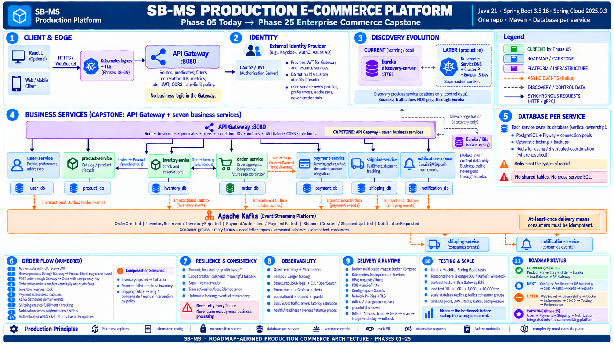

# SB-MS Production E-Commerce Platform

This architecture overview is constrained to the services and platform capabilities in [`sb-roadmap.md`](../../sb-roadmap.md). It is a destination map, not a claim that the future components already exist.

## Service evolution

| Stage | Components |
|---|---|
| Current through Phase 05 | `api-gateway`, `discovery-server`, `product-service`, `inventory-service`, `order-service` |
| Phase 25 capstone additions | `user-service`, `payment-service`, `shipping-service`, `notification-service` |
| Platform evolution | Config, Resilience4j, PostgreSQL hardening, Saga/outbox, Kafka, Redis, IdP/JWT, WebSocket, OpenTelemetry, structured logs, Prometheus, Grafana, Docker, Kubernetes, CI/CD, production testing |

The capstone boundary is **API Gateway plus seven business services**. Cart, search, pricing, promotions, reviews, fraud, analytics, and returns are intentionally absent because the current roadmap does not commit to them.

## Architectural invariants

- Database per service; no shared tables or cross-service SQL.
- Gateway is the sole client entry and contains no domain business logic.
- Eureka is a learning/local discovery mechanism; Kubernetes Service DNS supersedes it later.
- Synchronous calls are reserved for immediate answers; Kafka carries asynchronous domain events.
- Transactional outbox and idempotent consumers protect event publication and processing.
- Redis is an optimization or coordination tool, never the system of record.
- Services scale as stateless replicas; durable state remains external.
